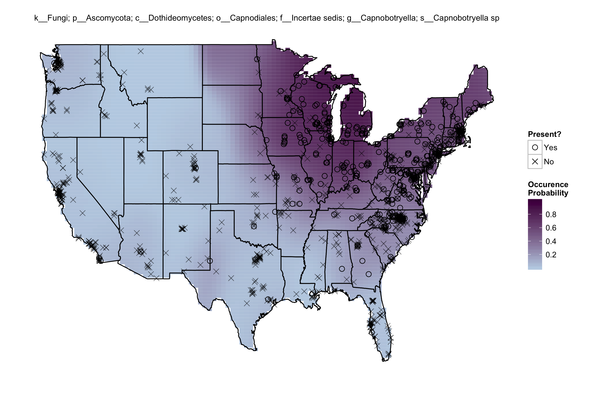
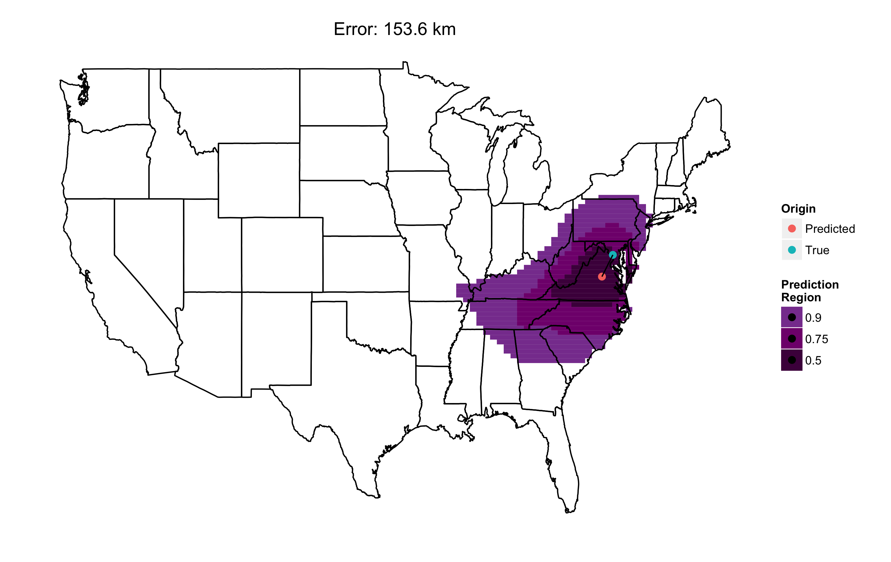

# Fungi Identify the Geographic Origin of Dust Samples

This repository provides `R` code to conduct spatial source prediction of dust samples relying solely on their dust-associated fungal communities. These methods mark a new approach to forensic biology that could be used by scientists to identify the origin of dust or soil samples found on objects, clothing, or archaeological artifacts.

For more information, please see our associated publication:

Grantham NS, Reich BJ, Pacifici K, Laber EB, Menninger HL, Henley JB, Barberan A, Leff JW, Fierer N, Dunn RR (2015) Fungi Identify the Geographic Origin of Dust Samples, _Accepted, PLoS ONE_.


## Get started

1. Fork or clone this repository onto your computer.
2. Open `R` and set the working directory to this directory. e.g., ```setwd("path/to/fungi-identify")```
3. Run `get-data.R` to download the data from the [1000homes figshare repository](http://figshare.com/articles/1000homes/1270900) (thanks Albert!) and munge it into `csv`.

__Note:__ You only need to run `get-data.R` once to download the files locally. This fills the subdirectory `data` with `S.csv` (lon, lat coordinates of each home), `X.csv` (covariate info for each home), and `Y.csv` (presence/absence of taxa per home). A further subdirectory `raw` is created that holds the pre-munged `txt`, `biom`, and `fa` data files.

To set up one's working environment, run `set-workspace.R`. This file loads pertinent `R` packages, sources user-defined functions in `functions.R`, and loads and (slightly) reformats the `csv` data files in `data`. 

## Plot estimated fungi occurrence probabilities

Produce taxon-specific "hot spot" maps via kernel smoothing using `plot-occurrence.R`.



## Demonstrate the model

`demonstrate-model.R` showcases the statistical analysis using a small subset of the taxa occurrence data over a single fold of the cross-validation.

__Note:__ The purpose of this file is to demonstrate the steps behind our predictions in a computationally feasible manner. Unsurprisingly, the predictions produced by operating on the full data in `cross-validate.R` are much better than those produced here.



## Replicate full analysis

The full analysis is conducted by `cross-validate.R`. It is recommended that this file be run on a server with many cores available. Make sure to set the number of available cores `ncore`. With the current size of the data (n = 1331 samples, m = 57304 fungi taxa), five-fold cross-validation across 10 cores required nearly 5 hours to complete. (Note: individual folds are _not_ run in parallel; rather, the species are split into `ncore` many groups to ensure the size of `M`, the kernel smoothed matrix of estimated occurrence probabilities, and `llike`, the log-likelihood values, are not prohibitively large.) 

This file produces `results.RData` containing `Tgrid`, a matrix of prediction points, and a list `results` of length `nfold`. Each element of `results` contains: 

- `pmf.test` and `pmf.test2`, probability mass function values over `Tgrid` for the locations relegated to the `test` and `test2` sets, 
- `Stest` and `Stest2`, the true origin of the samples in `test` and `test2`, and
- `Stest.hat` and `Stest2.hat`, the predicted geographic origin of sample in `test` and `test2`.

## Analyze predictions

After `results.RData` is produced, `analyze-predictions.R` loads and analyzes the predictions of the statistical model overall and across several covariates.


## Questions or comments?

We would love to hear from you. If you wish to speak about the motivation, scope, and direction of this project, consider contacting our corresponding author Robert R. Dunn (`Rob_Dunn@ncsu.edu`).

For questions regarding the specifics of the code provided here, please contact Neal S. Grantham (`ngranth@ncsu.edu`). If you would instead like to discuss the molecular sequencing methods and data provided at [1000homes figshare repository](http://figshare.com/articles/1000homes/1270900), please contact Albert Barberan (`albert.barberan@colorado.edu`).
